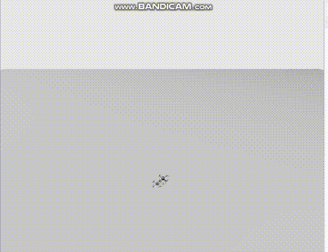

# HoldAltitudeNode

A program for controlling a quadcopter using MAVSDK and ROS 2 to hold a specified altitude.

---

## Requirements

- Ubuntu 22.04
- ROS 2 Humble
- MAVSDK (with Mavlink 2 support)
- PX4 SITL with gz_sim
- Compiler with C++17 support

---

## Build and Run

```bash
make
```

This command builds and runs the ROS 2 node using the launch file `control.launch.py`.

## Cleaning up and stopping processes

```bash
make kill
```

This command performs:  
- Terminates the processes gzserver, gz, px4_sitl, and px4  
- Checks port 14540 and kills any process that occupies this port, if any


## Demonstartion
